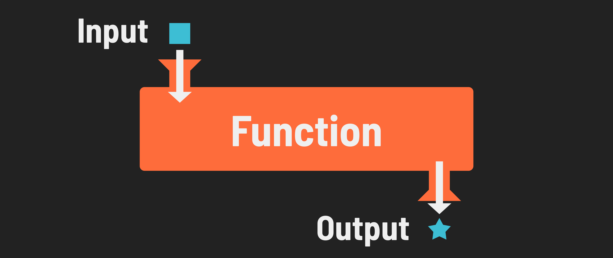
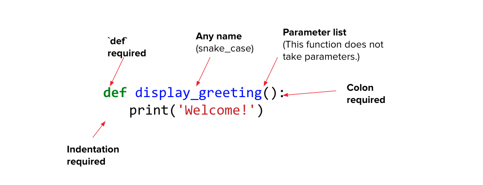
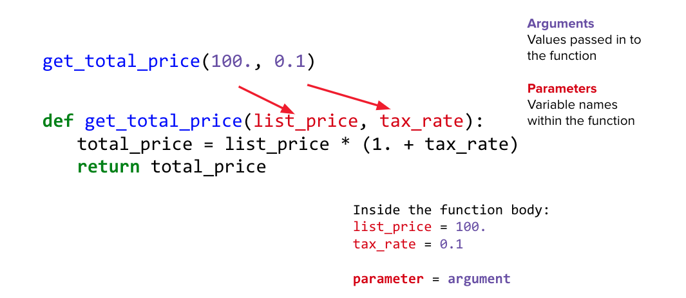

<h1>
  <span class="headline">Python Functions</span>
  <span class="subhead">Function Syntax</span>
</h1>

**Learning objective:** By the end of this lesson, students will be able to define, invoke, and work with functions in Python, including using parameters and arguments to create flexible and reusable code.

| Lesson          | Duration |
| --------------- | -------- |
| Function Syntax | 35 min   |

## Function Syntax

**Functions** are chunks of code that are grouped and will execute together, like a modular program within a program. A function takes input, performs logic, and returns output.



- Functions allow our programs to start accepting input in meaningful ways. We've already encountered the `print()` function — now we can start writing our own!

## Defining Functions



```python
def display_greeting():
    print('Welcome!')
```

| Part of a Function | Description                             |
| ------------------ | --------------------------------------- |
| `def`              | Required                                |
| Function Name      | Any name (snake_case)                   |
| Parameter List     | This function does not take parameters. |
| Colon              | Required                                |
| Indentation        | Required                                |

## Invoking Functions

Defining a function simply sets things up. For anything to happen, you must **invoke** the function at some point.

```python
def greetings():
    print("hello!")

# Invoke the function using its name and more parentheses.
greetings()
```

> It's common in the beginning to define a function but forget to run it. Remember, using a function is a two-step process: first, you define the function, and then you actually invoke (or call) it to execute the code inside.

## Function Parameters and Arguments



When defining functions, **Parameters** act as placeholders for the values that the function will operate on. **Arguments** are the actual values you pass into the function when invoking it.

Here is an example of a function that calculates the total price, including tax:

```python
def get_total_price(list_price, tax_rate):
    total_price = list_price * (1. + tax_rate)
    return total_price

get_total_price(100.0, 0.1)
```

In this function:

- `list_price` and `tax_rate` are _parameters_.
- When you call `get_total_price(100.0, 0.1)`, `100.0` and `0.1` are the _arguments_.

Inside the function body, the parameters are assigned the values of the arguments:

- `list_price = 100.0`
- `tax_rate = 0.1`

> **Parameters:** Variable names defined in the function signature that receive the argument values.

> **Arguments:** Values passed into the function when it is invoked.

## Keyword and Positional Arguments

When providing arguments to a function, you can either rely on the position or on keywords to define the specific inputs.

```python
def calculate_area(length, width):
    return length * width

calculate_area(8,9)

calculate_area(width=9, length=8)
```

<br>

<div class="activity knowledge-check">
  <h2 class="title">What Does This Function Do?</h2>
  <span class="minutes"></span>
</div>

```python
def mystery_function(list_to_check, value):
    for i in range(len(list_to_check)):
        if(list_to_check[i] == value):
        return i
    return -1
```

<details>
<summary>✅ Click to see the answer: </summary>
<hr>

This function will return the index location in the given array of the given value, so it’s a search function. If it doesn't find the value, it will return "-1".

</details>

<br>

<div class="activity partner-exercise">
  <h2 class="title">5.1 Functions</h2>
  <span class="minutes">30 min</span>
</div>

Most code challenges you come across will involve writing a function that provides a solution to a given problem. **Section 5.1** has some good initial code challenges to help you practice writing functions.
